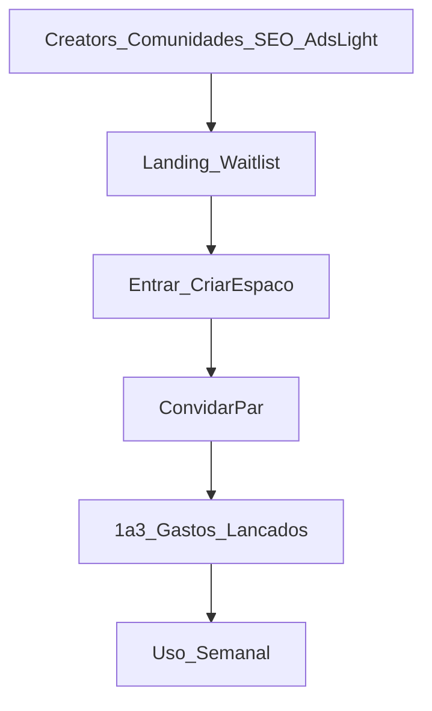

# Estratégia de lançamento (BR / PT-BR / MVP) — Conta de Casal

## Objetivo do lançamento

Validar tração com casais reais, gerando:

- **Ativação**: criação de espaço + convite aceito + 1–3 gastos lançados.
- **Retenção**: uso recorrente (ao menos semanal) e utilidade percebida (equilíbrio, clareza).
- **Compartilhamento**: convites como principal loop.

## ICP (perfil ideal)

### Primário: casais 22–40

- Morando juntos ou se organizando para isso.
- Já tiveram atritos leves por dinheiro (ou querem evitar).
- Sentem “cansaço de planilha” e querem algo simples.

### Secundário: casais “organizados”

- Querem visão rápida e equidade.
- Gostam de apps bonitos e leves.

## Problema → promessa (mensagem)

- **Problema**: “No fim do mês, ninguém lembra quanto foi e dá sensação de injustiça.”
- **Promessa**: “Clareza e equilíbrio sem esforço — dividir gastos com carinho.”

## Proposta de valor (1 frase)

Um espaço compartilhado para registrar gastos, dividir do jeito certo e acompanhar o saldo do casal em tempo real — simples, empático e sem planilhas.

## Pilares de mensagem (para copies)

1. **Clareza em minutos**: “Quem pagou o quê, sem discussão.”
2. **Equilíbrio**: “Saldo do mês sempre visível.”
3. **Parceria**: “Os dois no mesmo espaço.”
4. **Leveza**: “Organização que não pesa.”

## Canais e táticas (MVP)

### 1) UGC + creators (orgânico com potencial de ads)

- 10–20 creators pequenos/médios (casal, vida a dois, finanças simples, organização).
- Brief: 15–30s com “dor real” + “solução leve”.
- Usar códigos/links UTM por creator.

### 2) Comunidades

- Reddit/Discord/Telegram (finanças pessoais, vida a dois, organização).
- Conteúdo útil: “Como dividir gastos sem briga (modelo simples)”.
- CTA: “Se quiser algo mais leve que planilha: lista de espera / criar espaço”.

### 3) Conteúdo evergreen (SEO leve)

- 6–10 páginas/artigos (simples) focados em intenção:
  - “como dividir aluguel com namorado(a)”
  - “divisão de gastos casal 50/50”
  - “planilha gastos casal alternativa”

### 4) Lista de espera (página única)

- Promessa + 3 benefícios + prova (prints/mini-demo) + CTA.
- Captura: email + (opcional) whatsapp.

## Funil recomendado

## Plano 6 semanas (executável)

### Semana 1–2: pré-lançamento

- Landing + waitlist + eventos/UTMs.
- 15–30 criativos UGC (roteiro + gravação).
- “Kit creator” (copy + bullets + CTA).

### Semana 3: soft launch

- Lote pequeno de convites.
- Monitorar ativação e pontos de abandono.
- Ajustar onboarding e fricções.

### Semana 4: launch week

- Publicar 5–7 conteúdos (reels + stories + post).
- 5 creators no ar (1 por dia).
- Live/AMA curto: “dividir gastos sem briga”.

### Semana 5–6: otimização

- Dobrar no que performou (criativos/copy).
- Retenção: push/email leve (se aplicável) com “check-in semanal”.

## Assets mínimos (para executar)

- 1 landing (HTML ou página do app)
- 8–12 prints/gifs curtos
- 5 variações de headline
- 5 variações de CTA
- 10 variações de copy curta (ads/social)

## Métricas de sucesso (MVP)

- **Waitlist → signup**: >= 10–20%
- **Signup → espaço criado**: >= 60%
- **Espaço criado → convite enviado**: >= 70%
- **Convite enviado → convite aceito**: >= 40–60%
- **Ativação** (1–3 gastos): >= 40%
- **Retenção semanal**: evoluir, mas mirar >= 20–30% no início

